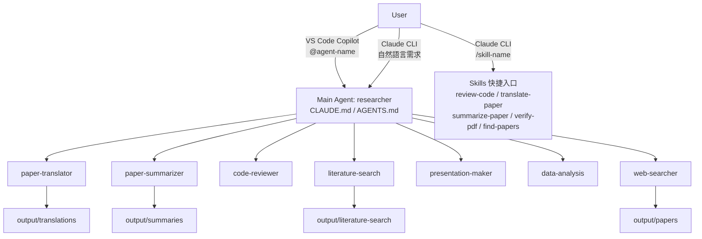

# 研究生 AI Agent（ASR 研究工作流自動化）

一個為語音辨識研究情境設計的多代理（Multi-Agent）系統，聚焦於研究生常見的高頻任務：

- 論文翻譯（中英段落交錯對照）
- 論文整理（概覽模式 / 詳細模式）
- 程式碼審查（需求符合性與潛在風險）
- 文獻搜尋與整理
- 簡報草稿生成
- 數據分析與視覺化
- 網路事實查核與 PDF 下載驗證

此專案以 Prompt Engineering + Orchestration 為核心，目標是把研究流程標準化、可重複化，並降低人工切換任務的成本。

---

## 作品定位（履歷亮點）

### 我解決了什麼問題？

研究工作常在「查資料 → 讀論文 → 翻譯整理 → 實作驗證 → 做報告」之間反覆切換，容易發生：

- 上下文遺失：每次都要重新解釋需求
- 產出格式不一致：不同任務難以整合
- 驗證不足：AI 生成內容表面可用，但細節常不符合規格

本系統透過主代理統一調度子代理，提供一致輸出規範、可追蹤流程與可擴充的任務分工。

### 核心優勢

1. 領域導向：針對自動語音辨識（Automatic Speech Recognition, ASR）場景設計。
2. 任務分工清楚：7 個子代理各司其職，降低單一 Prompt 過載。
3. 可驗證流程：內建 PDF 優先原則、下載完整性檢查與調度回報格式。
4. 雙入口相容：同時支援 VS Code Copilot 與 Claude CLI。
5. 可維護性高：規範集中在可版本控制的 Markdown 檔案，便於審查與迭代。

---

## 系統架構



### 主代理責任

- 理解需求
- 自動判斷任務型別
- 調度對應子代理
- 彙整結果並輸出調度報告

### 子代理能力

| 子代理 | 主要功能 | 典型輸出 |
|---|---|---|
| paper-translator | 論文中英段落交錯翻譯 | `output/translations/*_translation.md` |
| paper-summarizer | 概覽 / 詳細兩種整理模式 | `output/summaries/overview.md`、`output/summaries/*_summary.md` |
| code-reviewer | 需求符合性、邏輯錯誤與風險檢查 | 程式碼審查報告 |
| literature-search | 主題式文獻搜尋與排序 | `output/literature-search/*.md` |
| presentation-maker | 研究內容轉投影片結構 | Markdown 簡報稿 |
| data-analysis | 實驗數據分析與圖表 | 分析報告與圖表 |
| web-searcher | 網路查核、PDF 驗證與重下載 | 查核報告 / 驗證報告 |

---

## Claude Code Skills（直接呼叫入口）

除了主代理調度流程，本專案提供 5 個可直接在 **Claude CLI** 呼叫的 Skills，對應高頻單一任務。

> ⚠️ **Skills 為 Claude CLI 專屬**。VS Code Copilot 請改用 `@agent-name` 語法（如 `@paper-translator`）。

| Skill | 呼叫方式 | 功能 | 靈感來源 |
|-------|---------|------|---------|
| `/review-code` | 貼上程式碼後呼叫 | 三向平行審查（符合性、邏輯、風險）+ 結構化報告 | 官方 [`/simplify`](https://code.claude.com/docs/en/skills.md) |
| `/translate-paper [pdf]` | 指定 PDF 或留空選擇 | 英文論文 → 繁體中文中英對照 | — |
| `/summarize-paper [id\|--detail]` | 留空掃描全部 PDF | 概覽模式（多篇小卡）/ 詳細模式（單篇深入） | — |
| `/verify-pdf [path]` | 留空驗證所有 PDF | PDF 完整性檢查 + 自動重新下載 | 官方 [`/loop`](https://code.claude.com/docs/en/skills.md) |
| `/find-papers <topic>` | 指定主題關鍵字 | 平行搜尋 arXiv/Semantic Scholar/ISCA，產出分級報告 | 官方 [`/batch`](https://code.claude.com/docs/en/skills.md) |

> **Skills vs Sub-Agent**：Skills 供使用者直接觸發單一任務；需要跨任務串接（如「下載 → 翻譯 → 整理」）的複合工作流，仍由主代理自動調度 Sub-Agent 完成。

### 雙平台功能對照

| 功能 | VS Code Copilot | Claude CLI |
|------|:--------------:|:----------:|
| 主代理自動調度 | ✅ | ✅ |
| @agent-name 直接呼叫 | ✅ | ❌ |
| /skill-name 快捷入口 | ❌ | ✅ |
| 複合任務工作流 | ✅ | ✅ |

---

## 關鍵設計原則

### 1) PDF 優先原則

翻譯與摘要一律優先讀取本地 PDF（`output/papers/`），避免網頁內容不完整造成資訊偏差。

### 2) 統一輸出規範

- 語言：繁體中文
- 專業術語首次出現保留英文
- 數學公式使用 LaTeX（HackMD / VS Code 預覽相容）

### 3) 效率與品質平衡

- 多篇任務採分批處理，降低 token 風險
- 盡量避免不必要的中間暫存檔
- 透過標準化調度回報提升可追蹤性

### 4) 任務後自我修正（Post-Task Review）

在符合條件時，會回顧流程中的冗餘步驟並更新代理規範，以持續優化效率。

---

## 專案結構

```text
Agent/
├─ AGENTS.md
├─ CLAUDE.md
├─ agents/
│  ├─ code-reviewer/AGENTS.md
│  ├─ data-analysis/AGENTS.md
│  ├─ literature-search/AGENTS.md
│  ├─ paper-summarizer/AGENTS.md
│  ├─ paper-translator/AGENTS.md
│  ├─ presentation-maker/AGENTS.md
│  └─ web-searcher/AGENTS.md
├─ .claude/
│  └─ skills/                        ← Claude Code Skills（直接呼叫入口）
│     ├─ review-code/SKILL.md
│     ├─ translate-paper/SKILL.md
│     ├─ summarize-paper/SKILL.md
│     ├─ verify-pdf/SKILL.md
│     └─ find-papers/SKILL.md
├─ docs/
│  ├─ usage-guide.md
│  └─ workspace-standards.md
└─ output/
   ├─ papers/
   ├─ translations/
   ├─ summaries/
   └─ literature-search/
```

---

## 快速開始

### 在 VS Code Copilot 使用

1. 開啟此資料夾。
2. 開啟 Copilot Chat 並切換到 Agent Mode。
3. 直接輸入需求，或指定子代理（例如 `@paper-translator`）。

### 在 Claude CLI 使用

1. 進入專案目錄。
2. 執行 `claude`。
3. 依需求讓主代理自動調度，或明確指定任務類型。
4. 也可直接呼叫 Skills 執行單一任務，例如：
   ```
   /translate-paper output/papers/icassp/2401.08992_xxx.pdf
   /find-papers streaming ASR --venue Interspeech
   /review-code
   ```

---

## 範例任務

### 複合任務（翻譯 + 摘要）

```text
幫我處理這篇論文：先翻譯（中英對照）再依章節整理重點。
論文：output/papers/interspeech/<paper>.pdf
輸出到：output/
```

### 程式碼審查

```text
請審查以下 Python 程式碼是否符合串流 ASR 的 latency 需求，
並指出 edge cases 與修正建議。
```

---

## 我在這個專案中展現的能力

- 多代理系統設計（Multi-Agent Orchestration）
- Prompt Engineering 與規格化輸出設計
- 研究工作流建模與自動化
- 品質保證思維（完整性驗證、流程審查、可追蹤回報）
- 面向實務的 AI 工具整合（VS Code / CLI）

---

## 文件索引

- 主代理入口：`AGENTS.md`（VS Code）
- CLI 入口：`CLAUDE.md`
- 使用說明：`docs/usage-guide.md`
- 通用規範：`docs/workspace-standards.md`

---

## 授權與備註

- 建議於公開前補上授權條款（例如 MIT License）。
- `output/` 下內容多為執行產物，建議不納入版本控制（已於 `.gitignore` 設定）。
